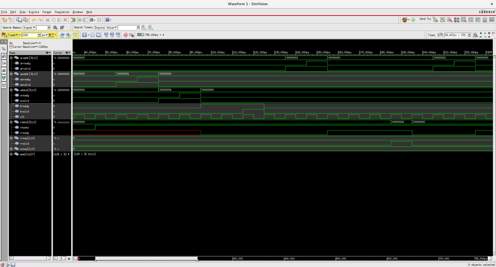
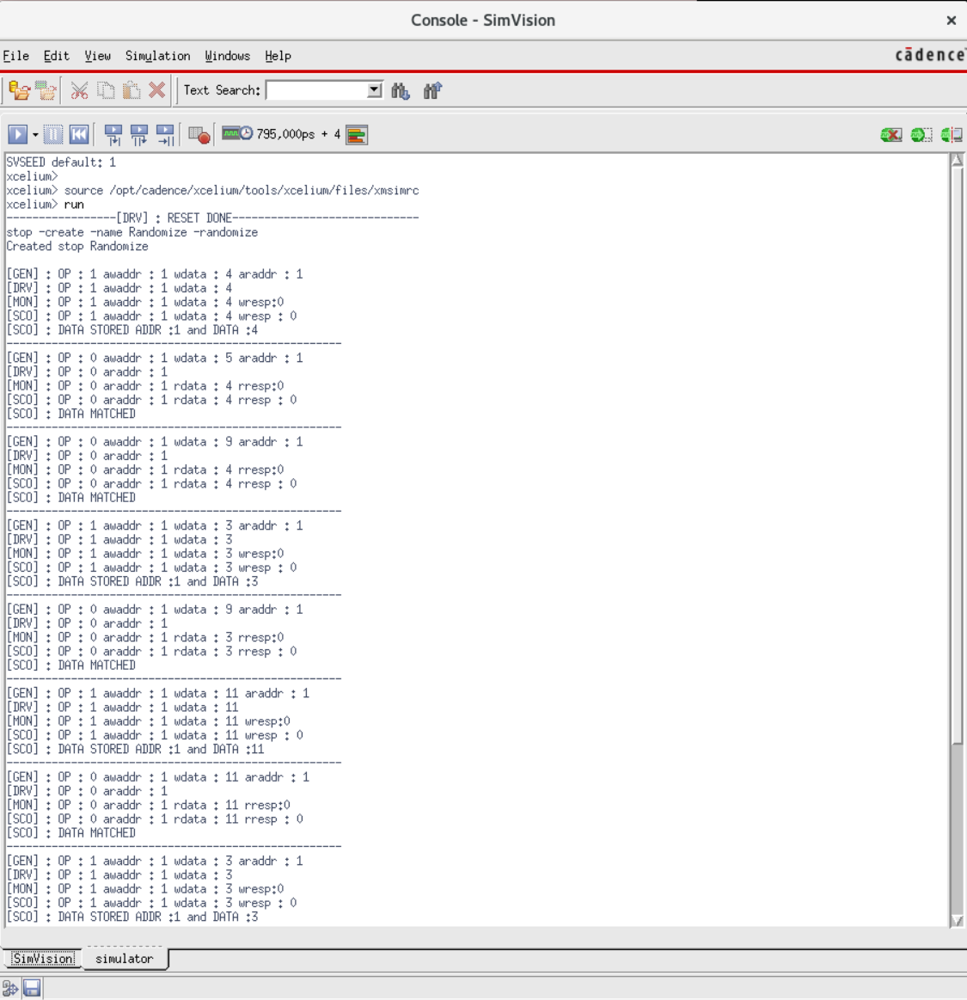
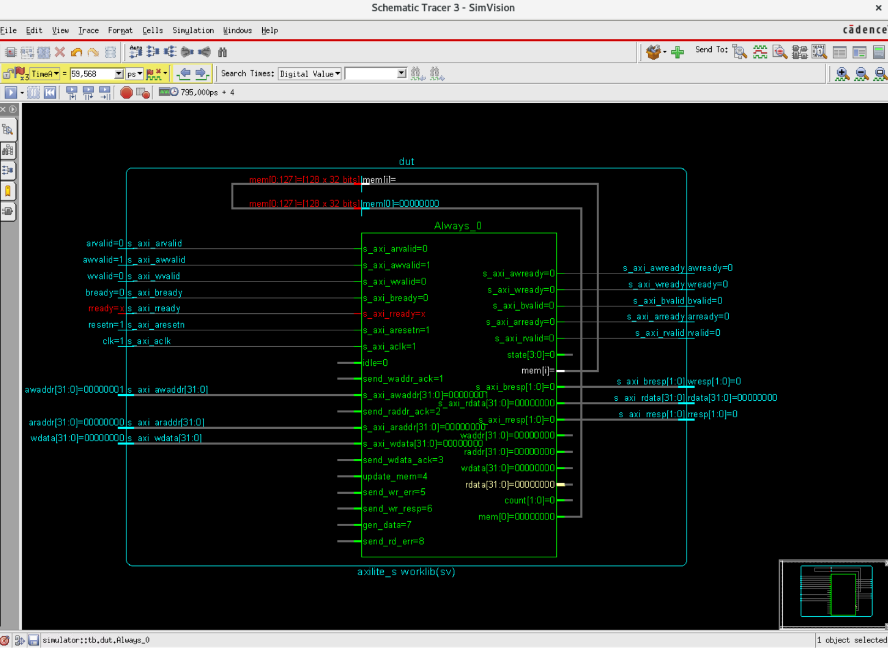

# **AXI-Lite Interface Project Documentation**

## 1. Project Overview

This project implements a basic **AXI4-Lite Slave** interface in *SystemVerilog*, along with a **Universal Verification Methodology (UVM)** testbench for verification. The AXI4-Lite protocol is a simplified version of the AXI4 protocol, commonly used for memory-mapped registers and low-bandwidth communication in System-on-Chip (SoC) designs.

The AXI4-Lite Slave module (`axilite_s.sv`) acts as a memory controller, allowing a master device to perform read and write operations to an internal memory array. The UVM testbench (`tb.sv`) is designed to generate random AXI4-Lite transactions (read and write), drive them to the *Device Under Test (DUT)*, monitor the DUT’s responses, and compare them against a reference model to ensure functional correctness.

## 2. Design Details — AXI-Lite Slave (`axilite_s.sv`)

The `axilite_s.sv` module implements the AXI4-Lite Slave interface. It handles the AXI handshake signals and manages read/write access to an internal memory.


### 2.1 Module Ports

The module defines the standard **AXI4-Lite slave** ports:

| Port Name        | Direction | Width | Description                                 |
| :--------------- | :-------- | :---- | :------------------------------------------ |
| `s_axi_aclk`     | Input     | 1     | AXI clock                                   |
| `s_axi_aresetn`  | Input     | 1     | AXI active-low reset                        |
| `s_axi_awvalid`  | Input     | 1     | Write address valid                         |
| `s_axi_awready`  | Output    | 1     | Write address ready                         |
| `s_axi_awaddr`   | Input     | 32    | Write address                               |
| `s_axi_wvalid`   | Input     | 1     | Write data valid                            |
| `s_axi_wready`   | Output    | 1     | Write data ready                            |
| `s_axi_wdata`    | Input     | 32    | Write data                                  |
| `s_axi_bvalid`   | Output    | 1     | Write response valid                        |
| `s_axi_bready`   | Input     | 1     | Write response ready                        |
| `s_axi_bresp`    | Output    | 2     | Write response (`OKAY`, `SLVERR`, `DECERR`) |
| `s_axi_arvalid`  | Input     | 1     | Read address valid                          |
| `s_axi_arready`  | Output    | 1     | Read address ready                          |
| `s_axi_araddr`   | Input     | 32    | Read address                                |
| `s_axi_rvalid`   | Output    | 1     | Read data valid                             |
| `s_axi_rready`   | Input     | 1     | Read data ready                             |
| `s_axi_rdata`    | Output    | 32    | Read data                                   |
| `s_axi_rresp`    | Output    | 2     | Read response (`OKAY`, `SLVERR`, `DECERR`)  |

---

### 2.2 Internal Memory

The slave contains an internal memory array `mem` with **128 × 32-bit** locations: 

`reg [31:0] mem [0:127];`


### 2.3 State Machine

The AXI-Lite slave employs a finite-state machine (FSM) to manage read and write transactions. The states are:

- `idle` — waiting for a write or read address  
- `send_waddr_ack` — acknowledging a write address  
- `send_raddr_ack` — acknowledging a read address  
- `send_wdata_ack` — acknowledging write data  
- `update_mem` — writing data to the internal memory  
- `send_wr_err` — sending a write-error response (e.g., out-of-bounds address)  
- `send_wr_resp` — sending a successful write response  
- `gen_data` — generating read data from memory  
- `send_rd_err` — sending a read-error response  
- `send_rdata` — sending read data to the master  

State transitions enforce proper AXI handshakes. For example, when a valid write address is presented (`s_axi_awvalid`), the slave asserts `s_axi_awready` and moves to `send_waddr_ack`. Similarly, a valid read address (`s_axi_arvalid`) causes `s_axi_arready` to be asserted, transitioning the FSM to `send_raddr_ack`.


### 2.4 Write Operation Flow

- **Address Phase**  
  The slave stays in `idle` until `s_axi_awvalid` is asserted. It then asserts `s_axi_awready`, latches `s_axi_awaddr`, and moves to `send_waddr_ack`.

- **Data Phase**  
  In `send_waddr_ack`, the slave waits for `s_axi_wvalid`. When asserted, it latches `s_axi_wdata`, asserts `s_axi_wready`, and transitions to `send_wdata_ack`.

- **Memory Update / Error**  
  - **Valid address (`0–127`)** — the FSM enters `update_mem`, writing `wdata` to `mem[waddr]`.  
  - **Invalid address** — the FSM enters `send_wr_err`, preparing a `DECERR` (`2'b11`) response.

- **Response Phase**  
  - From `update_mem`, the FSM moves to `send_wr_resp`, asserting `s_axi_bvalid` with an `OKAY` (`2'b00`) response.  
  - From `send_wr_err`, it asserts `s_axi_bvalid` with `DECERR`.  
  In both cases, the slave waits for `s_axi_bready` before returning to `idle`.

---

### 2.5 Read Operation Flow

- **Address Phase**  
  The slave stays in `idle` until `s_axi_arvalid` is asserted. It then asserts `s_axi_arready`, latches `s_axi_araddr`, and moves to `send_raddr_ack`.

- **Data Generation / Error**  
  - **Valid address** — the FSM transitions to `gen_data`.  
  - **Invalid address** — it transitions to `send_rd_err`, asserting `s_axi_rvalid` with `DECERR` (`2'b11`) and driving `s_axi_rdata` to `0`.

- **Data Phase**  
  In `gen_data`, the slave reads `mem[raddr]` into `rdata`. After an internal delay (handled by `count`), it asserts `s_axi_rvalid` with the data and an `OKAY` (`2'b00`) response.

- **Completion**  
  The slave waits for `s_axi_rready` before returning to `idle`. If in `send_rd_err`, it likewise waits for `s_axi_rready` before transitioning back to `idle`.


## 3. UVM Testbench Architecture (`tb.sv`)

The UVM testbench is composed of the standard components—**transaction, generator, driver, monitor,** and **scoreboard**.

---

### 3.1 `axi_if` Interface

The `axi_if` interface bundles all AXI-Lite signals to give the testbench a clean connection to the DUT.

```systemverilog
interface axi_if;
  logic        clk, resetn;

  // Write address channel
  logic        awvalid, awready;
  logic [31:0] awaddr;

  // Read address channel
  logic        arvalid, arready;
  logic [31:0] araddr;

  // Write data channel
  logic        wvalid, wready;
  logic [31:0] wdata;

  // Write response channel
  logic        bvalid, bready;
  logic [1:0]  wresp;

  // Read data channel
  logic        rvalid, rready;
  logic [31:0] rdata;
  logic [1:0]  rresp;
endinterface
```

### 3.2 `transaction` Class

The `transaction` class encapsulates the data and control signals for a single AXI-Lite transfer (write or read):

- `op` — random bit (`1'b1` = write, `1'b0` = read)  
- `awaddr`, `wdata` — random write address and data  
- `araddr` — random read address  
- `rdata`, `wresp`, `rresp` — non-random fields capturing response data and status  

**Constraints**

- `valid_addr_range` — restricts `awaddr` and `araddr` to **[1 : 4]**  
- `valid_data_range` — restricts `wdata` and `rdata` to values **< 12**

```systemverilog
class transaction;  
  randc bit         op;  
  rand bit \[31:0\] awaddr;  
  rand bit \[31:0\] wdata;  
  rand bit \[31:0\] araddr;  
        bit \[31:0\] rdata;  
        bit \[1:0\]  wresp;  
        bit \[1:0\]  rresp;

  constraint valid\_addr\_range {awaddr inside {\[1:4\]}; araddr inside {\[1:4\]};}  
  constraint valid\_data\_range {wdata \< 12; rdata \< 12;}  
endclass
```

### 3.3 `generator` Class

The `generator` produces randomized **`transaction`** objects and sends them to the driver via a mailbox.

- **`mbxgd`** — mailbox for generator-to-driver communication  
- **`count`** — total number of transactions to generate  
- **`run()` task** — randomizes each `transaction`, displays its fields, places it in the mailbox, and waits for the scoreboard to signal completion (`sconext`) before generating the next one  

```systemverilog
class generator;
  transaction                tr;
  mailbox #(transaction)     mbxgd;

  // Handshake events
  event done;     // generator finished all transactions
  event sconext;  // scoreboard finished processing

  int count = 0;

  function new (mailbox #(transaction) mbxgd);
    this.mbxgd = mbxgd;
    tr = new();
  endfunction

  task run();
    for (int i = 0; i < count; i++) begin
      assert(tr.randomize)
        else $error("Randomization Failed");

      $display("[GEN] : OP=%0b awaddr=%0d wdata=%0d araddr=%0d",
               tr.op, tr.awaddr, tr.wdata, tr.araddr);

      mbxgd.put(tr);
      @(sconext);
    end
    ->done;
  endtask
endclass
```

### 3.4 `driver` Class

The **driver** dequeues `transaction` objects from the generator mailbox and drives the corresponding AXI-Lite signals onto the DUT via the virtual interface.

- **Connections**
  - `vif` – virtual interface handle (`axi_if`)
  - `mbxgd` – mailbox *generator → driver*
  - `mbxdm` – mailbox *driver → monitor* (echoes every driven transaction)

- **Core Tasks**
  - **`reset()`** – asserts then releases `resetn`, initializing all AXI signals to their default idle values  
  - **`write_data()`**  
        1. Drives write-address (`aw*`) and write-data (`w*`) channels  
    2. Waits for handshake signals (`awready`, `wready`, `bvalid`)  
    3. De-asserts the channels and forwards the completed transaction to `mbxdm`  
  - **`read_data()`**  
        1. Drives read-address (`ar*`) channel  
    2. Waits for handshake signals (`arready`, `rvalid`)  
    3. Captures read data / response, de-asserts the channel, and forwards the transaction to `mbxdm`  
  - **`run()`** – infinite loop that fetches transactions from `mbxgd` and calls either `write_data()` or `read_data()` depending on `tr.op`

```systemverilog
class driver;  
  virtual axi\_if vif;  
  transaction tr;  
  mailbox \#(transaction) mbxgd;  
  mailbox \#(transaction) mbxdm;

  function new( mailbox \#(transaction) mbxgd,  mailbox \#(transaction) mbxdm);  
    this.mbxgd \= mbxgd;  
    this.mbxdm \= mbxdm;  
  endfunction

  // Resetting System  
  task reset();  
    vif.resetn  \<= 1'b0;  
    vif.awvalid \<= 1'b0;  
    vif.awaddr  \<= 0;  
    vif.wvalid \<= 0;  
    vif.wdata \<= 0;  
    vif.bready \<= 0;  
    vif.arvalid \<= 1'b0;  
    vif.araddr \<= 0;  
    repeat(5) @(posedge vif.clk);  
    vif.resetn \<= 1'b1;  
    $display("-----------------\[DRV\] : RESET DONE-----------------------------");  
  endtask

  task write\_data(input transaction tr);  
    $display("\[DRV\] : OP : %0b awaddr : %0d wdata : %0d ",tr.op, tr.awaddr, tr.wdata);  
    mbxdm.put(tr); // Send transaction to monitor  
    vif.resetn  \<= 1'b1;  
    vif.awvalid \<= 1'b1;  
    vif.arvalid \<= 1'b0;  ////disable read  
    vif.araddr  \<= 0;  
    vif.awaddr  \<= tr.awaddr;  
    @(negedge vif.awready);  
    vif.awvalid \<= 1'b0;  
    vif.awaddr  \<= 0;  
    vif.wvalid  \<= 1'b1;  
    vif.wdata   \<= tr.wdata;  
    @(negedge vif.wready);  
    vif.wvalid  \<= 1'b0;  
    vif.wdata   \<= 0;  
    vif.bready  \<= 1'b1;  
    vif.rready  \<= 1'b0;  
    @(negedge vif.bvalid);  
    vif.bready  \<= 1'b0;  
  endtask

  task read\_data(input transaction tr);  
    $display("\[DRV\] : OP : %0b araddr : %0d ",tr.op, tr.araddr);  
    mbxdm.put(tr); // Send transaction to monitor  
    vif.resetn  \<= 1'b1;  
    vif.awvalid \<= 1'b0;  
    vif.awaddr  \<= 0;  
    vif.wvalid  \<= 1'b0;  
    vif.wdata   \<= 0;  
    vif.bready  \<= 1'b0;  
    vif.arvalid \<= 1'b1;  
    vif.araddr  \<= tr.araddr;  
    @(negedge vif.arready);  
    vif.araddr  \<= 0;  
    vif.arvalid \<= 1'b0;  
    vif.rready  \<= 1'b1;  
    @(negedge vif.rvalid);  
    vif.rready  \<= 1'b0;  
  endtask

  task run();  
    forever  
    begin  
      mbxgd.get(tr); // Get transaction from generator  
      @(posedge vif.clk);  
      // write mode check and signal generation  
      if(tr.op \== 1'b1)  
        write\_data(tr);  
      else  
        read\_data(tr);  
    end  
  endtask  
endclass
```

### 3.5 `monitor` Class

The **monitor** passively observes AXI-Lite activity on the virtual interface, reconstructs `transaction` objects that reflect the DUT’s behavior, and forwards them to the scoreboard.

- **Connections**
  - `vif` – virtual interface handle (`axi_if`) used for signal observation
  - `mbxms` – mailbox *monitor → scoreboard* (sends observed transactions)
  - `mbxdm` – mailbox *driver → monitor* (receives the transactions originally driven)

- **`run()` Task**
  - Continuously samples the AXI signals.
  - **Write path**  
        1. Waits for `bvalid` to assert.  
    2. Captures `wresp`.  
    3. Waits for `bvalid` to de-assert.  
  - **Read path**  
        1. Waits for `rvalid` to assert.  
    2. Captures `rdata` and `rresp`.  
    3. Waits for `rvalid` to de-assert.  
  - Packs the captured information into a `transaction` object and places it into `mbxms`.

```systemverilog
class monitor;  
  virtual axi\_if vif;  
  transaction tr,trd;  
  mailbox \#(transaction) mbxms;  
  mailbox \#(transaction) mbxdm;

  function new( mailbox \#(transaction) mbxms , mailbox \#(transaction) mbxdm);  
    this.mbxms \= mbxms;  
    this.mbxdm \= mbxdm;  
  endfunction

  task run();  
    tr \= new();  
    forever  
    begin  
      @(posedge vif.clk);  
      mbxdm.get(trd); // Get transaction from driver

      if(trd.op \== 1\) // Write operation  
      begin  
        tr.op     \= trd.op;  
        tr.awaddr \= trd.awaddr;  
        tr.wdata  \= trd.wdata;  
        @(posedge vif.bvalid); // Wait for write response valid  
        tr.wresp  \= vif.wresp;  
        @(negedge vif.bvalid); // Wait for write response valid to go low  
        $display("\[MON\] : OP : %0b awaddr : %0d wdata : %0d wresp:%0d",tr.op, tr.awaddr, tr.wdata, tr.wresp);  
        mbxms.put(tr); // Send observed transaction to scoreboard  
      end  
      else // Read operation  
      begin  
        tr.op \= trd.op;  
        tr.araddr \= trd.araddr;  
        @(posedge vif.rvalid); // Wait for read data valid  
        tr.rdata \= vif.rdata;  
        tr.rresp \= vif.rresp;  
        @(negedge vif.rvalid); // Wait for read data valid to go low  
        $display("\[MON\] : OP : %0b araddr : %0d rdata : %0d rresp:%0d",tr.op, tr.araddr, tr.rdata, tr.rresp);  
        mbxms.put(tr); // Send observed transaction to scoreboard  
      end  
    end  
  endtask  
endclass
```

### 3.6 `scoreboard` Class

The **scoreboard** receives `transaction` objects from the monitor and checks them against an internal reference model to verify DUT correctness.

- **Connections**  
  &nbsp;&nbsp;• `mbxms` — mailbox *monitor → scoreboard*  
  &nbsp;&nbsp;• `data[128]` — local reference memory mirroring the DUT state  
  &nbsp;&nbsp;• `sconext` — event signaling the generator that a check is complete  

- **`run()` Task**  
  &nbsp;&nbsp;• **Write path**  
  &nbsp;&nbsp;&nbsp;&nbsp;1. If `wresp == 3`, display **“DEC ERROR”**.  
  &nbsp;&nbsp;&nbsp;&nbsp;2. Otherwise, update `data[awaddr]` with `wdata`.  
  &nbsp;&nbsp;• **Read path**  
  &nbsp;&nbsp;&nbsp;&nbsp;1. Compare `rdata` with `data[araddr]`.  
  &nbsp;&nbsp;&nbsp;&nbsp;2. Display **“DATA MATCHED”** or **“DATA MISMATCHED”**.  
  &nbsp;&nbsp;&nbsp;&nbsp;3. Flag an error if `rresp == 3`.  
  &nbsp;&nbsp;• After each transaction is processed, trigger `sconext`.

```systemverilog
class scoreboard;  
  transaction tr,trd;  
  event sconext;

  mailbox \#(transaction) mbxms;

  bit \[31:0\] temp;  
  bit \[31:0\] data\[128\] \= '{default:0}; // Reference memory model

  function new( mailbox \#(transaction) mbxms);  
    this.mbxms \= mbxms;  
  endfunction

  task run();  
    forever  
    begin  
      mbxms.get(tr); // Get observed transaction from monitor

      if(tr.op \== 1\) // Write operation  
      begin  
        $display("\[SCO\] : OP : %0b awaddr : %0d wdata : %0d wresp : %0d",tr.op, tr.awaddr, tr.wdata, tr.wresp);  
        if(tr.wresp \== 3\) // Check for write error response  
          $display("\[SCO\] : DEC ERROR");  
        else begin  
          data\[tr.awaddr\] \= tr.wdata; // Update reference model  
          $display("\[SCO\] : DATA STORED ADDR :%0d and DATA :%0d", tr.awaddr, tr.wdata);  
        end  
      end  
      else // Read operation  
      begin  
        $display("\[SCO\] : OP : %0b araddr : %0d rdata : %0d rresp : %0d",tr.op, tr.araddr, tr.rdata, tr.rresp);  
        temp \= data\[tr.araddr\]; // Get expected data from reference model  
        if(tr.rresp \== 3\) // Check for read error response  
          $display("\[SCO\] : DEC ERROR");  
        else if (tr.rresp \== 0 && tr.rdata \== temp) // Check for data match  
          $display("\[SCO\] : DATA MATCHED");  
        else  
          $display("\[SCO\] : DATA MISMATCHED");  
      end  
      $display("----------------------------------------------------");  
      \-\>sconext; // Signal generator to produce next transaction  
    end  
  endtask  
endclass
```

### 3.7 Top-Level Testbench Module (`tb`)

The **`tb`** module instantiates the DUT, the `axi_if` interface, and all UVM components, while also handling clock generation and overall simulation flow.

- **DUT Instantiation**  
  &nbsp;&nbsp;• `axilite_s dut (...)` — connects the DUT ports to the `axi_if` interface  

- **Clock Generation**  
  &nbsp;&nbsp;• `vif.clk` initialized to **0**  
  &nbsp;&nbsp;• `always` block toggles the clock every **5 time-units** → 10 ns period  

- **Component Instantiation & Connection**  
  &nbsp;&nbsp;• Mailboxes: `mbxgd`, `mbxms`, `mbxdm` for inter-component communication  
  &nbsp;&nbsp;• UVM objects: **generator, driver, monitor, scoreboard** instantiated and wired via these mailboxes  

- **Virtual Interface Assignment**  
  &nbsp;&nbsp;• `vif` handle attached to **driver** and **monitor** instances  

- **Event Synchronization**  
  &nbsp;&nbsp;• `sconext` event coordinates **generator** and **scoreboard** so that the generator waits until the scoreboard finishes checking before issuing the next transaction  

- **Simulation Flow**  
  &nbsp;&nbsp;1. `drv.reset()` — applies reset to the DUT  
  &nbsp;&nbsp;2. `fork ... join_any` — launches `gen.run()`, `drv.run()`, `mon.run()`, `sco.run()` concurrently; simulation proceeds while any task is active  
  &nbsp;&nbsp;3. `wait(gen.done.triggered)` — pauses until the generator completes all transactions  
  &nbsp;&nbsp;4. `$finish` — terminates the simulation  

- **VCD Dump**  
  &nbsp;&nbsp;• An `initial` block enables VCD waveform dumping for post-simulation viewing

```systemverilog
module tb;

  monitor mon;  
  generator gen;  
  driver drv;  
  scoreboard sco;

  event nextgd;  
  event nextgm;

  mailbox \#(transaction) mbxgd, mbxms, mbxdm;

  axi\_if vif(); // Instantiate the AXI interface

  // Instantiate the Device Under Test (DUT)  
  axilite\_s dut (vif.clk, vif.resetn, vif.awvalid, vif.awready, vif.awaddr,  
                 vif.wvalid, vif.wready,  vif.wdata,  
                 vif.bvalid, vif.bready,  vif.wresp ,  
                 vif.arvalid, vif.arready, vif.araddr,  
                 vif.rvalid, vif.rready, vif.rdata, vif.rresp);

  // Clock generation  
  initial begin  
    vif.clk \<= 0;  
  end

  always \#5 vif.clk \<= \~vif.clk; // 10ns clock period

  initial begin  
    // Instantiate mailboxes  
    mbxgd \= new();  
    mbxms \= new();  
    mbxdm \= new();

    // Instantiate UVM components  
    gen \= new(mbxgd);  
    drv \= new(mbxgd,mbxdm);  
    mon \= new(mbxms,mbxdm);  
    sco \= new(mbxms);

    // Set generator transaction count  
    gen.count \= 10;

    // Connect virtual interfaces to driver and monitor  
    drv.vif \= vif;  
    mon.vif \= vif;

    // Connect events for synchronization  
    gen.sconext \= nextgm;  
    sco.sconext \= nextgm;  
  end

  initial begin  
    drv.reset(); // Perform reset sequence  
    fork // Start all components concurrently  
      gen.run();  
      drv.run();  
      mon.run();  
      sco.run();  
    join\_any // Continue as long as any task is running  
    wait(gen.done.triggered); // Wait for generator to complete all transactions  
    $finish; // End simulation  
  end

  // VCD dump setup for waveform viewing  
  initial begin  
    $dumpfile("dump.vcd");  
    $dumpvars;  
  end  
endmodule
```

## 4. Simulation Results

### 4.1 Waveform Analysis

The figure below illustrates a typical AXI-Lite **write** and **read** transaction.

- **Write Transaction Example**  
  &nbsp;&nbsp;• `awvalid` asserts, presenting a valid write address  
  &nbsp;&nbsp;• `awready` asserts, acknowledging the address  
  &nbsp;&nbsp;• `wvalid` asserts, presenting valid write data  
  &nbsp;&nbsp;• `wready` asserts, acknowledging the data  
  &nbsp;&nbsp;• `bvalid` asserts, presenting a valid write response  
  &nbsp;&nbsp;• `bready` asserts, acknowledging the response  
  &nbsp;&nbsp;• `bresp` shows the status (e.g., **00** = OKAY)

   <!-- {PICTURE} -->

- **Read Transaction Example**  
  &nbsp;&nbsp;• `arvalid` asserts, presenting a valid read address  
  &nbsp;&nbsp;• `arready` asserts, acknowledging the address  
  &nbsp;&nbsp;• `rvalid` asserts, presenting valid read data  
  &nbsp;&nbsp;• `rready` asserts, acknowledging the data  
  &nbsp;&nbsp;• `rdata` shows the returned data  
  &nbsp;&nbsp;• `rresp` shows the status (e.g., **00** = OKAY)

These traces confirm correct AXI-Lite handshakes and signal transitions.

---

### 4.2 Console Output

The console log captures messages from the **generator**, **driver**, **monitor**, and **scoreboard**, confirming the transaction flow and verification results.

 <!-- {PICTURE} -->

Key observations:

- **\[GEN\]** — randomized transactions generated  
- **\[DRV\]** — transactions driven to the DUT  
- **\[MON\]** — transactions observed from DUT outputs  
- **\[SCO\]** — scoreboard results  
  - *“DATA STORED ADDR :%0d DATA :%0d”* — successful write recorded in reference memory  
  - *“DATA MATCHED”* — read data matches expected value  
  - *“DEC ERROR”* — decode error (invalid address access)

---

### 4.3 Schematic Tracer

A schematic tracer visualizes the DUT’s internal signals and connections, aiding debugging and structural understanding.

 <!-- {PICTURE} -->


## 5. How to Simulate

To run this project, you’ll need a SystemVerilog simulator such as **Cadence Xcelium**, **Synopsys VCS**, or **Mentor QuestaSim**.

---

### 5.1 Downloading the Files

Save each SystemVerilog block into a separate file:

    1. **`axilite_s.sv`** — AXI-Lite Slave module  
    2. **`axi_if.sv`** — AXI interface definition  
    3. **`tb.sv`** — UVM testbench components and top-level module  

> **Directory suggestion:** `axi_lite_project/`

---

### **5.2. Running with Cadence Xcelium**

Once you have saved the files, you can compile and run the simulation using Cadence Xcelium.

1. **Open a terminal or command prompt.**  
2. **Navigate to your project directory:**  
   ```sh
   cd axi\_lite\_project/
   ```

3. **Compile & run the simulation**  
   Use the `xrun` command to compile the SystemVerilog files and launch the simulation:  

   - `-sv` &nbsp;&nbsp;— enables SystemVerilog features  
   - `-access +rwc` &nbsp;&nbsp;— grants read / write / connect access for debugging  
   - `-timescale 1ns/1ps` &nbsp;&nbsp;— sets the simulation time-scale 
   ```sh 
   xrun \-sv \-access \+rwc \-timescale 1ns/1ps axi\_if.sv axilite\_s.sv tb.sv
   ```

   *Note: If you prefer to use a Tcl script for running, you can create a run.tcl file with run and exit commands and then use xrun \-input run.tcl as shown in the previous version.*  

4. **View waveforms**  
   After the simulation completes, a `dump.vcd` file will be generated in your project directory. Open it with Cadence **SimVision** (or any compatible VCD viewer):

   ```sh
   simvision dump.vcd

This will generate a dump.vcd file which can be opened with a waveform viewer like SimVision.